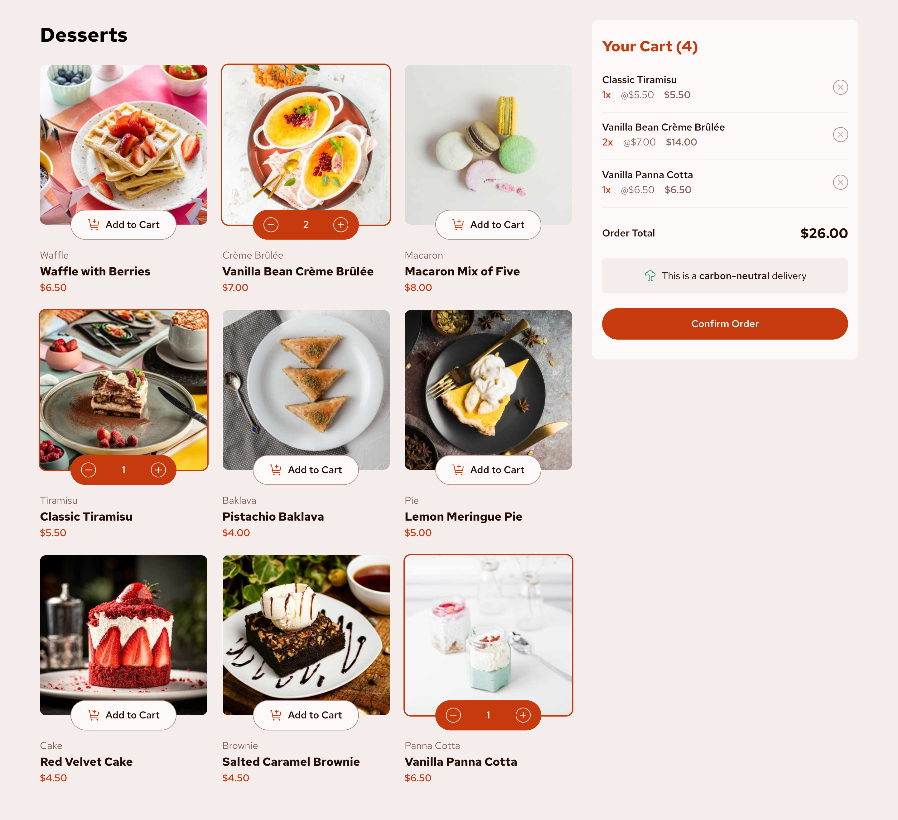

# Frontend Mentor - Product list with cart solution

This is a solution to the [Product list with cart challenge on Frontend Mentor](https://www.frontendmentor.io/challenges/product-list-with-cart-5MmqLVAp_d). Frontend Mentor challenges help you improve your coding skills by building realistic projects.

## Table of contents

- [Overview](#overview)
  - [The challenge](#the-challenge)
  - [Screenshot](#screenshot)
  - [Links](#links)
- [My process](#my-process)
  - [Built with](#built-with)
- [Author](#author)

## Overview

### The challenge

Users should be able to:

- Add items to the cart and remove them
- Increase/decrease the number of items in the cart
- See an order confirmation modal when they click "Confirm Order"
- Reset their selections when they click "Start New Order"
- View the optimal layout for the interface depending on their device's screen size
- See hover and focus states for all interactive elements on the page

### Screenshot

### Links

- Solution URL: [https://www.frontendmentor.io/solutions/product-list-with-cart-Q2vvNBGyQ2](https://www.frontendmentor.io/solutions/product-list-with-cart-Q2vvNBGyQ2)
- Live Site URL: [https://fem-product-list-with-cart.netlify.app](https://fem-product-list-with-cart.netlify.app)

## My process

### Built with

- Semantic HTML5 markup
- Flexbox
- CSS Grid
- Mobile-first workflow
- [React](https://reactjs.org/)
- [Vite](https://vite.dev/)
- [Sass](https://sass-lang.com/)
- [Redux Toolkit](https://redux-toolkit.js.org/)

## Author

- Portfolio - [https://garciadev.netlify.app/](https://garciadev.netlify.app/)
- Frontend Mentor - [@FrontendBy-GJ](https://www.frontendmentor.io/profile/FrontendBy-GJ)
